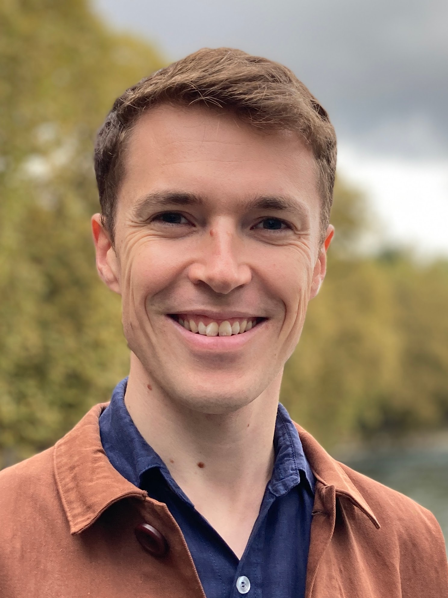

{:style="display: block; width: auto; height:350px; margin-left: auto; margin-right:40px; float: left;"}
I am a postdoc in the group of [Prof. Nicola Marzari](https://people.epfl.ch/nicola.marzari) at EPFL in Switzerland. 

Broadly, I am interested in how we can improve the performance of density functional theory (DFT). Inspired by known properties of the exact functional and the systemic errors of DFT, one can construct inexpensive corrections to DFT that drastically improve its performance.

Most recently, I have developed the [``koopmans``](https://github.com/epfl-theos/koopmans) code, a package that implements Koopmans functionals. By imposing a generalized piecewise energy condition, these functionals obtain spectral properties with comparable accuracy to GW at a fraction of the cost.

My other research interests include linear-scaling density functional theory and methods for treating strong correlation (such as dynamical mean field theory).

I completed my PhD at the University of Cambridge, supervised by [Dr. Daniel Cole](https://blogs.ncl.ac.uk/danielcole/) and [Prof. Mike Payne](http://www.tcm.phy.cam.ac.uk/profiles/mcp1/). You can view my full CV [here](./cv/cv.pdf).

<a class="twitter-timeline" data-width="500" data-height="600" data-theme="dark" href="https://twitter.com/ed_linscott?ref_src=twsrc%5Etfw">Tweets by ed_linscott</a> 

